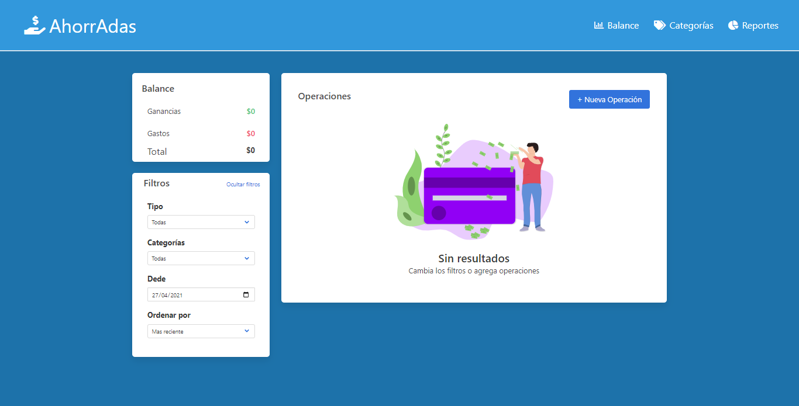

# AhorrAda's by Mariana 💸

Aplicación que permite llevar un registro de gastos y ganancias y un balance de los mismos.
Proyecto realizado como evaluación final del quinto modulo del curso desarrollo FrontEnd, utilizando **JavaScript** para modificar dinámicamente el contenido y las propiedades de la imagen y el texto.

 

## 👀 Haciendo click [aquí](https://maricaroj.github.io/proyecto-ahorradas-mariana/) puedes verlo andar y hacer tu control de gastos y ganancias 💰

 

📌 ***Este proyecto utiliza las siguientes dependencias:*** 

📁 [Bulma](https://bulma.io/)
 

📁  [uuid](https://github.com/uuidjs/uuid#readme)

  

---
Hecho con mucho amor por [Mí](https://github.com/maricaroj)💛💙❤️